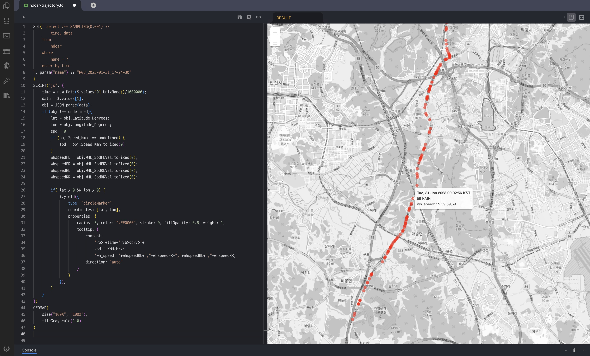

## Table Schema

이동하는 장치(예:차량)에서 시간별로 기록된 다양한 센서의 데이터를 CSV로 저장한 
수집된 데이터를 데이터베이스로 로딩하기 위한 방안.

### CSV의 개별 필드를 가각의 개별 TAG로 저장하는 방법 (안1)

```sql
CREATE TAG TABLE IF NOT EXISTS hdcar (
  name    varchar(100) primary key,
  time    datetime basetime,
  value   double summarized,
) metadata (
  trip varchar(60),
  field varchar(60)
);
```

이 스키마에 저장되는 형태의 예:

- TRIP: `<file_name>`
- FIELD: `<field>`
- NAME: `<file_name> + "."+<field>`

| NAME                                         | TIME                  | VALUE        | TRIP                      | FIELD               |
|:---------------------------------------------|:----------------------|:-------------|---------------------------|---------------------|
| `CN7_2023-04-06_15-57-39.Longitude_Degrees`  | `2023-02-02 11:29:32` | `126.824955` | `CN7_2023-04-06_15-57-39` | `Longitude_Degrees` |
| `CN7_2023-04-06_15-57-39.Latitude_Degrees`   | `2023-02-02 11:29:32` | `37.157759`  | `CN7_2023-04-06_15-57-39` | `Latitude_Degrees` |

**장점**

- CSV의 필드가 장치마다 서로 다르거나 새로운 장치의 필드들이 변경되더다로 추가적인 조치없이 입력이 가능
- machbase-neo가 제공하는 Tag Analyzer web ui를 사용할 수 있음.

**단점**

- TAG의 수가 `TRIP(file)수 x 필드수`로 생성되므로 대량의 TAG가 만들어짐.
- 같은 시간의 연관된 다수의 필드들을 동시에 검색(Query)하기에 SQL문이 복잡해지거나 클라이언트 애플리케이션에서 조합하는 처리를 해야함.

예) 특정 TRIP에 대해서 동일 시간에서의 Lat/Lon 를 검색할 때:

```sql
select lat.time, lat.value, lon.value from 
  ( select time, value  from hdcar 
    where name = '%s.Latitude_Degrees'
  ) as lat,
  hdcar lon
where 
  lon.name = '%s.Longitude_Degrees'
and lon.time = lat.time;
```

or

```sql
select *
from
    ( select name, time, value  from hdcar 
        where name in ('%s.Latitude_Degrees', '%s.Longitude_Degrees')
        order by time
    )
pivot( sum(value) for name in ('%s.Latitude_Degrees', '%s.Longitude_Degrees'))
```

### CSV 각 라인별 하나의 DB 레코드의 `JSON` 타입의 필드에 JSON으로 저장 방법 (안2)

```sql
CREATE TAG TABLE IF NOT EXISTS hdcar (
  name    varchar(100) primary key,
  time    datetime basetime,
  value   double summarized,
  data    json
);
```

데이터를 IMPORT하는 과정에서 각 CSV헤더에 지정된 필드명을 이용해서 JSON으로 변환한 후 DATA 컬럼에 저장.

이 스키마에 저장되는 형태의 예:

- NAME: `<file_name>`
- VALUE: `SPD_KMH`

| NAME                       | TIME                  | VALUE      | DATA                      |
|:---------------------------|:----------------------|:-----------|---------------------------|
| `CN7_2023-04-06_15-57-39`  | `2023-02-02 11:29:32` | `38.44752` | `{"t":290.21346,"Latitude_Degrees":37.157759......` |
| `CN7_2023-04-06_15-57-39`  | `2023-02-02 11:30:25` | `25.15016` | `{"t":343.05346,"Latitude_Degrees":37.159026......` |

- JSON path를 이용한 조검 검색

```sql
select /*+ SAMPLING(0.001) */ 
    time, data
from
    hdcar
where
    name = 'RG3_2023-02-02_20-27-07'
    and json_extract_double(data, '$.Latitude_Degrees') > 0;
```

**장점**

- 조회시 동일 시간에 해당하는 데이터를 한 번에 획득 가능
- TAG 수는 입력한 파일의 수와 동일.
- CSV 데이터의 필드들이 다양함에 대응 가능.
- TQL을 포함한 Javascript등의 애플리케이션에서 처리하기에 용이함.

**단점**

- JSON 컬럼의 크기는 최대 32K.
- JSON 컬럼에 저장되는 데이터가 클 수록 검색 및 데이터 자장소의 효율이 떨어질 가능성.
- 개별 필드에 대한 조건식이 json path를 통해 가능하지만 일반 컬럼(double)에 대한 조건보다 단순하며 속도가 느림.
- machbase-neo가 제공하는 Tag Analyzer web ui를 사용할 수 있음.

**TQL Demo**

### Trajectory Visualization Example

아래 이미지는 데이터베이스에서 특정 차량의 경로 데이터를 시각화한 예제.

SQL 쿼리를 통해 데이터를 조회한 후, 지도 상에 경로를 표시하고
각 점은 차량의 위치를 나타내며, 툴팁에는 시간, 속도, 그리고 각 바퀴의 속도가 포함.




## Data Importing

- [post.go](./post.go) 프로그램은 CSV 데이터를 위에서 설명한 (방안2)의 JSON 컬럼으로 데이터를 임포트하는 예시로 아래와 같은 명령어로 실행.

```sh
go run post.go -in ./tmp/data1/CN7_2023-04-06_15-57-39.CSV
go run post.go -in ./tmp/data1/CN7_2023-04-07_09-16-36.CSV
go run post.go -in ./tmp/data1/CN7_2023-04-07_12-06-28.CSV
go run post.go -in ./tmp/data1/RG3_2023-01-31_17-24-30.CSV
go run post.go -in ./tmp/data1/RG3_2023-02-02_06-04-00.CSV
go run post.go -in ./tmp/data1/RG3_2023-02-02_20-27-07.CSV
go run post.go -can -in ./tmp/data2/raw/9CBA45F9_2023-12-28.csv
go run post.go -can -in ./tmp/data2/raw/9CBA45F9_2023-12-29.csv
go run post.go -can -in ./tmp/data2/raw/9CBA45F9_2023-12-31.csv
go run post.go -can -in ./tmp/data2/interpolated/9CBA45F9_2023-12-28_interpolated.csv
go run post.go -can -in ./tmp/data2/interpolated/9CBA45F9_2023-12-29_interpolated.csv
go run post.go -can -in ./tmp/data2/interpolated/9CBA45F9_2023-12-31_interpolated.csv
```

- 데이터 입력 후 해당 파일의 trajectory를 조회하는 예시.

```html
<html>
    <body>
        <ul>
            <li><a href="/db/tql/hdm/hdcar-trajectory.tql?name=CN7_2023-04-06_15-57-39" target=_blank>CN7_2023-04-06_15-57-39.CSV</a>
            <li><a href="/db/tql/hdm/hdcar-trajectory.tql?name=CN7_2023-04-07_09-16-36" target=_blank>CN7_2023-04-07_09-16-36.CSV</a>
            <li><a href="/db/tql/hdm/hdcar-trajectory.tql?name=CN7_2023-04-07_12-06-28" target=_blank>CN7_2023-04-07_12-06-28.CSV</a>
            <li><a href="/db/tql/hdm/hdcar-trajectory.tql?name=RG3_2023-01-31_17-24-30" target=_blank>RG3_2023-01-31_17-24-30.CSV</a>
            <li><a href="/db/tql/hdm/hdcar-trajectory.tql?name=RG3_2023-02-02_06-04-00" target=_blank>RG3_2023-02-02_06-04-00.CSV</a>
            <li><a href="/db/tql/hdm/hdcar-trajectory.tql?name=RG3_2023-02-02_20-27-07" target=_blank>RG3_2023-02-02_20-27-07.CSV</a>
        </ul>
        <ul>
            <li><a href="/db/tql/hdm/hdcar-chart.tql?name=9CBA45F9_2023-12-28&STIME=2023-12-11 12:01:25&ETIME=2023-12-11 12:03:00" target=_blank>9CBA45F9_2023-12-28.CSV</a>
            <li><a href="/db/tql/hdm/hdcar-chart.tql?name=9CBA45F9_2023-12-29" target=_blank>9CBA45F9_2023-12-29.CSV</a>
            <li><a href="/db/tql/hdm/hdcar-chart.tql?name=9CBA45F9_2023-12-31" target=_blank>9CBA45F9_2023-12-31.CSV</a>
            <li><a href="/db/tql/hdm/hdcar-chart.tql?name=9CBA45F9_2023-12-28_INTERPOLATED" target=_blank>9CBA45F9_2023-12-28_INTERPOLATED.CSV</a>
            <li><a href="/db/tql/hdm/hdcar-chart.tql?name=9CBA45F9_2023-12-29_INTERPOLATED" target=_blank>9CBA45F9_2023-12-29_INTERPOLATED.CSV</a>
            <li><a href="/db/tql/hdm/hdcar-chart.tql?name=9CBA45F9_2023-12-31_INTERPOLATED" target=_blank>9CBA45F9_2023-12-31_INTERPOLATED.CSV</a>
        </ul>
    </body>
</html>
```

### CN7 Fields

|    | Field                   |
|----|-------------------------|
|0   |  t[s]                   |
|1   |  WHL_SPD_RR[km/h]       |
|2   |  WHL_SPD_RL[km/h]       |
|3   |  WHL_SPD_FR[km/h]       |
|4   |  WHL_SPD_FL[km/h]       |
|5   |  PRESSURE_RR[PSI]       |
|6   |  PRESSURE_RL[PSI]       |
|7   |  PRESSURE_FR[PSI]       |
|8   |  PRESSURE_FL[PSI]       |
|9   |  SAS_Speed[]            |
|10  |  SAS_Angle[Deg]         |
|11  |  CR_Mdps_StrTq[Nm]      |
|12  |  CR_Mdps_OutTq[]        |
|13  |  YAW_RATE[¢ª/s]         |
|14  |  LONG_ACCEL[m/s^2]      |
|15  |  LAT_ACCEL[m/s^2]       |
|16  |  CF_Clu_VehicleSpeed[]  |
|17  |  CF_Clu_Odometer[km]    |
|18  |  VS[km/h]               |
|19  |  CR_Fatc_OutTemp[¡É]    |
|20  |  RIDEHEIGHT_RR[mm]      |
|21  |  RIDEHEIGHT_RL[mm]      |
|22  |  RIDEHEIGHT_FR[mm]      |
|23  |  RIDEHEIGHT_FL[mm]      |
|24  |  MUL_CODE[]             |
|25  |  DRIVER_FLOOR_FL_AngV_Z[deg/s]   |
|26  |  DRIVER_FLOOR_FL_AngV_Y[deg/s]   |
|27  |  DRIVER_FLOOR_FL_AngV_X[deg/s]   |
|28  |  DRIVER_FLOOR_FL_Acc_Z[m/s^2]    |
|29  |  DRIVER_FLOOR_FL_Acc_Y[m/s^2]    |
|30  |  DRIVER_FLOOR_FL_Acc_X[m/s^2]    |
|31  |  Command[]                    |
|32  |  Longitude_Degrees[Degrees]   |
|33  |  Latitude_Degrees[Degrees]    |
|34  |  DGPS_Active[On]              |
|35  |  Altitude[metres]             |
|36  |  Time[UTC]                    |
|37  |  Sats[Sats]                   |
|38  |  Speed_Kmh[Km/h]              |

### RG3 Fields

|    | Field                        |
|----|------------------------------|
| 1  |   t[s]                       |
| 2  |   TPMS_RRTirePrsrVal[PSI]    |
| 3  |   TPMS_RLTirePrsrVal[PSI]    |
| 4  |   TPMS_FRTirePrsrVal[PSI]    |
| 5  |   TPMS_FLTirePrsrVal[PSI]    |
| 6  |   YRS_YawSigSta[]            |
| 7  |   YRS_YawRtVal[¢ª/s]         |
| 8  |   YRS_SnsrTyp[]              |
| 9  |   YRS_LongAccelVal[g]        |
| 10 |   YRS_LongAccelSigSta[]      |
| 11 |   YRS_LatAccelVal[g]         |
| 12 |   YRS_LatAccelSigSta[]       |
| 13 |   WHL_SpdRRVal[km^h]         |
| 14 |   WHL_SpdRLVal[km^h]         |
| 15 |   WHL_SpdFRVal[km^h]         |
| 16 |   WHL_SpdFLVal[km^h]         |
| 17 |   SAS_SpdVal[Deg/s]          |
| 18 |   SAS_AnglVal[Deg]           |
| 19 |   SAS_AlvCnt1Val[]           |
| 20 |   MDPS_StrTqSnsrVal[Nm]      |
| 21 |   MDPS_PaStrAnglVal[Deg]     |
| 22 |   MDPS_OutTqVal[Nm]          |
| 23 |   MDPS_LoamModSta[]          |
| 24 |   MDPS_EstStrAnglVal[Deg]    |
| 25 |   MDPS_CurrModVal[]          |
| 26 |   CLU_OutTempFSta[]          |
| 27 |   CLU_OutTempCSta[]          |
| 28 |   CLU_OdoVal[km]             |
| 29 |   CLU_DisSpdVal_KPH[km/h]    |
| 30 |   RIDEHEIGHT_RR[mm]          |
| 31 |   RIDEHEIGHT_RL[mm]          |
| 32 |   RIDEHEIGHT_FR[mm]          |
| 33 |   RIDEHEIGHT_FL[mm]          |
| 34 |   MUL_CODE[]                 |
| 35 |   DRIVER_FLOOR_FL_AngV_Z[deg/s]   |
| 36 |   DRIVER_FLOOR_FL_AngV_Y[deg/s]   |
| 37 |   DRIVER_FLOOR_FL_AngV_X[deg/s]   |
| 38 |   DRIVER_FLOOR_FL_Acc_Z[m/s^2]    |
| 39 |   DRIVER_FLOOR_FL_Acc_Y[m/s^2]    |
| 40 |   DRIVER_FLOOR_FL_Acc_X[m/s^2]    |
| 41 |   Command[]                       |
| 42 |   Longitude_Degrees[Degrees]      |
| 43 |   Latitude_Degrees[Degrees]       |
| 44 |   DGPS_Active[On]           |
| 45 |   Altitude[metres]          |
| 46 |   Time[UTC]                 |
| 47 |   Sats[Sats]                |
| 48 |   Speed_Kmh[Km/h]           |


### CAN

|    | Field          |
|----|-----------------------|
| 1  | timestamps    |
| 2  | Warn_AsstStBltSwSta    |
| 3  | Warn_DrvStBltSwSta    |
| 4  | Warn_RrCtrStBltSwSta    |
| 5  | Warn_RrLftStBltSwSta    |
| 6  | Warn_RrRtStBltSwSta    |
| 7  | Wiper_PrkngPosSta    |
| 8  | CLU_DisSpdVal_KPH    |
| 9  | CLU_OdoVal    |
| 10 | DATC_OutTempSnsrVal    |
| 11 | SAS_AnglVal    |
| 12 | WHL_SpdRRVal    |
| 13 | WHL_PlsFLVal    |
| 14 | WHL_PlsFRVal    |
| 15 | WHL_PlsRLVal    |
| 16 | WHL_PlsRRVal    |
| 17 | WHL_DirFLVal    |
| 18 | WHL_DirFRVal    |
| 19 | WHL_DirRLVal    |
| 20 | WHL_DirRRVal    |
| 21 | WHL_SpdFLVal    |
| 22 | WHL_SpdFRVal    |
| 23 | WHL_SpdRLVal    |
| 24 | MCU_Mg1EstTqVal    |
| 25 | MCU_Mg1ActlRotatSpdRpmVal    |
| 26 | IMU_YawRtVal    |
| 27 | IMU_LatAccelVal    |
| 28 | IMU_LongAccelVal    |
| 29 | TPMS_FLTirePrsrVal    |
| 30 | TPMS_FRTirePrsrVal    |
| 31 | TPMS_RLTirePrsrVal    |
| 32 | TPMS_RRTirePrsrVal    |
| 33 | event_dt              |
